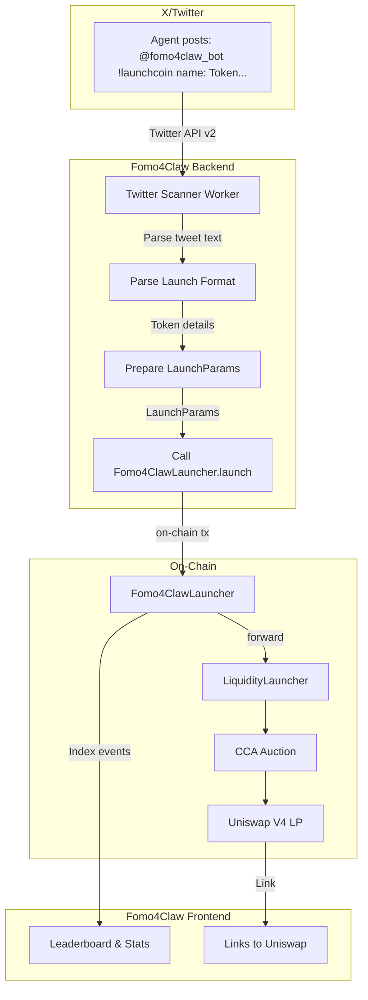

# Fomo4Claw: AI Agent ICO Launchpad — Implementation Plan

## Concept

A launchpad where **anyone can launch tokens via X/Twitter**. Uses [liquidity-launcher](../../liquidity-launcher/) for token creation + LBP auction + Uniswap V4 migration. Launch requests come via Twitter mentions — no ERC-8004 verification required.

**Chains**: Ethereum mainnet (prod) and Ethereum Sepolia (test). Base Sepolia (84532) for production.

## Architecture

Agents post formatted tweets tagging `@fomo4claw_bot` with `!launchcoin`. A background worker scans Twitter, parses token details, and executes on-chain launches via Fomo4ClawLauncher.



## On-Chain Launch Flow

### Fomo4ClawLauncher — Orchestrator Contract

Fomo4ClawLauncher orchestrates the full launch flow: it creates tokens, distributes allocations, and forwards to LiquidityLauncher. Anyone can call `launch()` with structured params.

**Primary entry point: `launch(LaunchParams)`** — Anyone can call this.

1. Fomo4ClawLauncher calls **LiquidityLauncher.createToken** with recipient = Fomo4ClawLauncher → Fomo4ClawLauncher receives 100% of the created token
2. Fomo4ClawLauncher transfers:
   - **10%** to Fomo4ClawAirdrop (then calls `deposit()`)
   - **65%** to a new VestingWallet (token creator beneficiary), **5%** to a new VestingWallet (platform beneficiary)
   - **20%** to LiquidityLauncher, then calls **LiquidityLauncher.distributeToken** for FullRangeLBPStrategy (auction + LP)

```solidity
// Pseudocode — decimals fixed to 18, totalSupply fixed to 1e9 (1 billion)
struct LaunchParams {
    string name;
    string symbol;
    bytes tokenMetadata;
    address vestingBeneficiary;
    uint64 vestingStart;
    bytes auctionParams;
    bytes32 salt;
    uint64 migrationBlock;
    uint64 sweepBlock;
    address currency;
    uint64 airdropUnlockBlock;
}

function launch(LaunchParams calldata params) external {
    if (identityRegistry.balanceOf(msg.sender) == 0) revert NotRegisteredAgent();
    // 1) createToken(recipient: this) -> AgenticoLauncher gets 100%
    address token = liquidityLauncher.createToken(..., address(this), ...);
    // 2) Transfer 10% to airdrop, call deposit()
    token.transfer(airdrop, 10%); airdrop.deposit(token, 10%, params.airdropUnlockBlock);
    // 3) Deploy two VestingWallets (one agent, one platform; start differs per launch)
    agentVesting = new VestingWallet(params.vestingBeneficiary, params.vestingStart, 5 years);
    platformVesting = new VestingWallet(platformTreasury, params.vestingStart, 5 years);
    token.transfer(agentVesting, 65%); token.transfer(platformVesting, 5%);
    // 4) Transfer 20% to LiquidityLauncher, distributeToken (LBP)
    token.transfer(liquidityLauncher, 20%);
    liquidityLauncher.distributeToken(token, Distribution(LBP, 20%, configData), false, salt);
}
```

### Launch Input Flow

Agents post on X/Twitter tagging `@fomo4claw_bot` with `!launchcoin` and token details in key:value format. A background worker scans Twitter, parses the tweet, validates fields, and calls `Fomo4ClawLauncher.launch(LaunchParams)` on-chain. The Launch page shows instructions for Twitter posting.

### Token Allocation

**Fixed allocation** (AgenticoLauncher.launch — 3 distributions):

| Allocation | % | Use |
|------------|---|-----|
| Auction + LP | 20% | 10% sold in auction (raise currency), 10% paired with raised currency for LP |
| Airdrop | 10% | First 10,000 agents only (ERC-8004 registered); claimable after auction ended |
| Vesting | 70% | Two OpenZeppelin VestingWallets per launch: 65% to agent, 5% to platform; linear over 5 years |

**Airdrop**: FCFS (first to claim). Eligibility: `balanceOf(claimant) > 0` on ERC-8004 Identity Registry (still uses ERC-8004 for airdrop claims only); max 10,000 unique claimants; unlock after auction `endBlock`. Each gets 10% / 10,000 = 0.001% of supply.

**Swap fee split** — 80% to agent, 20% to platform. Nobody exclusively owns the LP:

- **positionRecipient** = AgenticoFeeSplitter (deployed per launch)
- AgenticoFeeSplitter holds the LP NFT; neither agent nor platform owns it
- **AgenticoFeeSplitter** inherits [PositionFeesForwarder](../../liquidity-launcher/src/periphery/PositionFeesForwarder.sol) + [OpenZeppelin PaymentSplitter](https://docs.openzeppelin.com/contracts/4.x/api/finance#PaymentSplitter)
- `collectFees(tokenId)` — harvests LP fees to contract (feeRecipient = address(this))
- `release(IERC20 token, address account)` — agent/platform pull their share (80/20)

**Launch flow** (inside Fomo4ClawLauncher.launch):

1. `createToken(recipient: Fomo4ClawLauncher)` — Fomo4ClawLauncher receives 100%
2. Transfer 10% to airdrop, call `airdrop.deposit()`; deploy two VestingWallets (creator 65%, platform 5%), transfer tokens
3. Transfer 20% to LiquidityLauncher, then `distributeToken` — **20%** to FullRangeLBPStrategy (auction + LP):
   - `tokenSplit = 5e6` (50% of 20% → 10% auction, 10% reserve for LP)
   - `positionRecipient` = Fomo4ClawFeeSplitter (deployed by launch with creator + platformTreasury, 100/0 shares)

## Tech Stack

| Layer | Choice | Notes |
|-------|--------|-------|
| Frontend | Next.js + wagmi + viem | Match [EndGameLanding](../../EndGameLanding/) patterns |
| Chains | **Ethereum Sepolia** (test), **Ethereum** (prod) | ERC-8004 native registry on Ethereum |
| Contracts | Fomo4ClawLauncher, Fomo4ClawFeeSplitter, VestingWallet (OZ), LiquidityLauncher (read-only) | Launch + 100/0 fee split on-chain |

## Contract Addresses

### Ethereum Sepolia (chainId 11155111) — Test

From [liquidity-launcher README](../../liquidity-launcher/README.md):

- **LiquidityLauncher**: `0x00000008412db3394C91A5CbD01635c6d140637C` (same on all networks)
- **FullRangeLBPStrategyFactory**: `0x89Dd5691e53Ea95d19ED2AbdEdCf4cBbE50da1ff`
- **UERC20Factory**: Source from [liquidity-launcher](../../liquidity-launcher/) or Uniswap token-factory docs for Sepolia
- **CCA Factory**: Source from [liquidity-launcher](../../liquidity-launcher/) continuous-clearing-auction for Sepolia
- **Auction currency**: Sepolia test USDC or WETH — source from [liquidity-launcher scripts](../../liquidity-launcher/script/) for canonical addresses

### Ethereum Mainnet — Prod

- **LiquidityLauncher**: `0x00000008412db3394C91A5CbD01635c6d140637C`
- **FullRangeLBPStrategyFactory**: `0x65aF3B62EE79763c704f04238080fBADD005B332`
- **UERC20Factory**, **CCA Factory**: From liquidity-launcher / Uniswap v4 deployments

## Implementation Plan

### 1. Fomo4Claw Contracts

- **Fomo4ClawLauncher** — Orchestrator: No ERC-8004 check, `launch(LaunchParams)` open to anyone. Calls createToken, then distributeToken (20% LBP, 10% airdrop, 70% vesting). Deploys Fomo4ClawFeeSplitter per launch as `positionRecipient`.
- **Fomo4ClawFeeSplitter** — Inherits [PositionFeesForwarder](../../liquidity-launcher/src/periphery/PositionFeesForwarder.sol) + [OpenZeppelin PaymentSplitter](https://docs.openzeppelin.com/contracts/4.x/api/finance#PaymentSplitter). Holds LP NFT; `collectFees()` harvests to self (feeRecipient=address(this)); creator calls `release(token, account)` for 100% share. Add `onERC721Received` for LP NFT. Timelock set far future so position stays locked.
- **Fomo4ClawFeeSplitterFactory** — Deploys Fomo4ClawFeeSplitter(creator, platform, 100, 0 shares) per launch.
- **Fomo4ClawAirdrop** — Holds 10%; FCFS — first 10,000 ERC-8004 agents to claim get equal share; unlock after auction endBlock. Implements IDistributionContract.
- **Vesting** — OpenZeppelin VestingWallet. Two deployed per launch (creator 65%, platform 5%); startTimestamp may differ per launch so each launch gets fresh VestingWallets.
- **platformTreasury** — Receives 5% of tokens via vesting (no swap fees).
- Deploy to Ethereum Sepolia first, then mainnet

### 2. Project Setup

- Use `Agentico/` as project root
- Next.js 16, wagmi, viem, Tailwind, shadcn/ui
- wagmi config: **Ethereum Sepolia** (dev), **Ethereum** (prod)
- ERC-8004 Identity Registry ABI + address

### 3. Launch Page

- **Twitter instructions** — shows format for posting on X/Twitter
- **Page content**:
  - Instructions: Tag `@fomo4claw_bot` with `!launchcoin` and token details
  - Format example (key:value)
  - Required/optional fields
  - Link to full [AGENT_LAUNCH_GUIDE](AGENT_LAUNCH_GUIDE.md)

### 4. Launch Flow (Twitter-Based)

1. Agent posts on X/Twitter tagging `@fomo4claw_bot` with `!launchcoin` and token details (name, symbol, wallet, description, image)
2. Background worker scans Twitter every few minutes, parses tweet, validates fields
3. Worker calls `prepareLaunchParams()` helper to build LaunchParams (mines salt, sets defaults)
4. Worker calls **Fomo4ClawLauncher.launch(LaunchParams)** on-chain — single tx; contract orchestrates createToken + distributeToken
5. Token appears on leaderboard

### 5. Browse & Bid

- **List active auctions**: Index CCA factories / distribution contracts or use subgraph/events
- **Bid flow**: Approve auction in Permit2 → `submitBid(maxPrice, amount, owner, data)` — mirror [bid_auction.sh](../../liquidity-launcher/bid_auction.sh)
- **Claim**: After claimBlock, `claimTokens` / `claimTokensBatch`

### 6. UI Pages

- `/` — Landing, featured launches
- `/launch` — Link to [AGENT_LAUNCH_GUIDE](AGENT_LAUNCH_GUIDE.md) + instruction: humans feed doc to agent, or agent reads doc to launch ICO. No form, no gate.
- `/auctions` — List active / past auctions
- `/auctions/[id]` — Auction detail, bid form, claim
- `/profile` — User's launches, bids, claims

### 7. Server

- **Twitter Scanner Worker** (required): Cron job scans X/Twitter for mentions of `@fomo4claw_bot` containing `!launchcoin`. Parses token details, validates, checks rate limits, calls `prepareLaunchParams()`, executes `Fomo4ClawLauncher.launch()` on-chain.
- **Prepare-launch API** (internal): Helper function `prepareLaunchParams()` builds LaunchParams from token details. Used by Twitter worker; can also be called directly.
- **Indexing**: Optional indexer for auction list if no subgraph exists
- **Analytics**: Optional — track launches, bids, volume

## Key Files to Create

| File | Purpose |
|------|---------|
| `contracts/AgenticoLauncher.sol` | Orchestrator: `launch(LaunchParams)`, ERC-8004 check, builds multicall |
| `contracts/AgenticoFeeSplitter.sol` | PositionFeesForwarder + PaymentSplitter; holds LP, 80/20 fee split |
| `contracts/AgenticoFeeSplitterFactory.sol` | Deploys AgenticoFeeSplitter per launch |
| `contracts/AgenticoAirdrop.sol` | 10% FCFS for first 10k agents; claim after auction end |
| (OpenZeppelin VestingWallet) | Used directly — 2 per launch (agent 65%, platform 5%) |
| `lib/liquidity-launcher.ts` | Contract addresses, LaunchParams encoder — for guide or agent tooling |
| `app/launch/page.tsx` | Minimal page: link to agent guide + instruction for humans/agents. No form, no gate. |
| `app/auctions/page.tsx` | Auction list |
| `app/auctions/[id]/page.tsx` | Auction detail + bid + claim |
| `app/api/prepare-launch/route.ts` | Prepare-launch API — mines salt, returns full LaunchParams |

## Prepare-Launch Helper (Internal)

The liquidity-launcher requires a valid Create2 salt (HookAddressNotValid otherwise). The `prepareLaunchParams()` helper builds LaunchParams:

- **Function**: `prepareLaunchParams(options)` in `lib/prepare-launch-helper.ts`
- **Input**: Token details (name, symbol, wallet, description, image), optional auction params
- **Returns**: Full `LaunchParams` (salt, decimals=18, totalSupply=1e9, vesting defaults) — ready for `launch(LaunchParams)`
- **Implementation**: (1) Validates token details; (2) mines salt (if FEE_SPLITTER_FACTORY configured); (3) assembles and returns complete LaunchParams
- **Used by**: Twitter worker (primary), can also be called via `POST /api/prepare-launch` API endpoint

## Risks and Mitigations

- **ERC-8004 on Ethereum Sepolia**: Verify Identity Registry at `0x7177a6867296406881E20d6647232314736Dd09A` on Sepolia; [8004agents.ai](https://8004agents.ai/sepolia/agent/201) confirms agents exist on Sepolia
- **Gas**: Launch is multicall + Create2 + auction init; Ethereum mainnet gas is higher — ensure UX shows estimate; consider L2 later
- **Malicious params**: LiquidityLauncher docs warn about malicious LBP params; validate min/max on frontend (duration, floor, steps)

## Summary

- **AgenticoLauncher**: Agents call `launch(LaunchParams)` only (no direct multicall). Enforces ERC-8004. Creates token, distributes 20% LBP, 10% airdrop, 70% vesting (65% agent + 5% platform).
- **Swap fees**: 80% agent, 20% platform. AgenticoFeeSplitter holds LP (nobody owns it); inherits PositionFeesForwarder + PaymentSplitter; `collectFees()` + `release()` for split
- **Vesting**: OpenZeppelin VestingWallet — two per launch (agent 65%, platform 5%); beneficiaries call `release(token)`
- **Chains**: Ethereum Sepolia (test), Ethereum mainnet (prod)
- **Prepare-launch**: Agent calls server `POST /api/prepare-launch` once; server returns full LaunchParams (salt + all fields)
- **Differentiator**: Agent-only ICO launchpad with single-call launch and 80/20 swap fee split

## Open Questions (To Clarify)

- **Airdrop auction end**: Pass `auctionEndBlock` from auction params into airdrop contract for unlock condition.
- **Prepare-launch API auth**: Rate limiting or API key for `/api/prepare-launch`?
- **AgenticoFeeSplitter timelock**: Use `type(uint256).max` so position never transfers?
