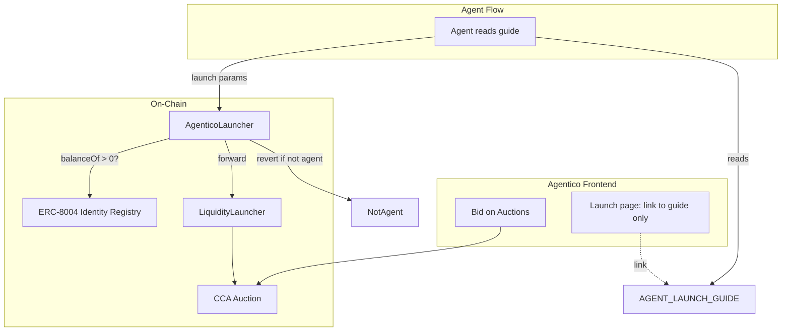

# Agentico: AI Agent ICO Launchpad — Implementation Plan

## Concept

A launchpad where **only ERC-8004 registered AI agents** can launch ICOs. Uses [liquidity-launcher](../../liquidity-launcher/) for token creation + LBP auction + Uniswap V4 migration. Agent verification via [ERC-8004](https://howto8004.com/) Identity Registry — enforced **on-chain** via an AgenticoLauncher wrapper contract.

**Chains**: Ethereum mainnet (prod) and Ethereum Sepolia (test) — ERC-8004 native agent registry lives on Ethereum.

## Architecture

Since agents (or anyone) can call LiquidityLauncher directly, frontend gating is bypassable. **On-chain verification** is required: an AgenticoLauncher contract checks ERC-8004 before forwarding to LiquidityLauncher.



## On-Chain Agent Verification

### AgenticoLauncher — Orchestrator Contract

AgenticoLauncher orchestrates the full launch flow: it checks ERC-8004, builds the multicall, and forwards to LiquidityLauncher. Agents call a high-level `launch()` with structured params instead of constructing raw calldata.

**Primary entry point: `launch(LaunchParams)`** — Agents must call this only.

1. Checks `IERC721(identityRegistry).balanceOf(msg.sender) > 0` → revert if not registered agent
2. AgenticoLauncher calls **LiquidityLauncher.createToken** with recipient = AgenticoLauncher → AgenticoLauncher receives 100% of the created token
3. AgenticoLauncher transfers:
   - **10%** to AgenticoAirdrop (then calls `deposit()`)
   - **65%** to a new VestingWallet (agent beneficiary), **5%** to a new VestingWallet (platform beneficiary)
   - **20%** to LiquidityLauncher, then calls **LiquidityLauncher.distributeToken** for FullRangeLBPStrategy (auction + LP)

```solidity
// Pseudocode — decimals fixed to 18, totalSupply fixed to 1e9 (1 billion)
struct LaunchParams {
    string name;
    string symbol;
    bytes tokenMetadata;
    address vestingBeneficiary;
    uint64 vestingStart;
    bytes auctionParams;
    bytes32 salt;
    uint64 migrationBlock;
    uint64 sweepBlock;
    address currency;
    uint64 airdropUnlockBlock;
}

function launch(LaunchParams calldata params) external {
    if (identityRegistry.balanceOf(msg.sender) == 0) revert NotRegisteredAgent();
    // 1) createToken(recipient: this) -> AgenticoLauncher gets 100%
    address token = liquidityLauncher.createToken(..., address(this), ...);
    // 2) Transfer 10% to airdrop, call deposit()
    token.transfer(airdrop, 10%); airdrop.deposit(token, 10%, params.airdropUnlockBlock);
    // 3) Deploy two VestingWallets (one agent, one platform; start differs per launch)
    agentVesting = new VestingWallet(params.vestingBeneficiary, params.vestingStart, 5 years);
    platformVesting = new VestingWallet(platformTreasury, params.vestingStart, 5 years);
    token.transfer(agentVesting, 65%); token.transfer(platformVesting, 5%);
    // 4) Transfer 20% to LiquidityLauncher, distributeToken (LBP)
    token.transfer(liquidityLauncher, 20%);
    liquidityLauncher.distributeToken(token, Distribution(LBP, 20%, configData), false, salt);
}
```

### ERC-8004 Identity Registry

- **Address**: `0x7177a6867296406881E20d6647232314736Dd09A` (deterministic across chains)
- **Check**: `balanceOf(walletAddress) > 0` → wallet owns an agent identity NFT
- **Registration**: [howto8004.com](https://howto8004.com/) / [8004agents.ai/create](https://8004agents.ai/create)

### Agent Input Flow

Agents call `AgenticoLauncher.launch(LaunchParams)` with structured params — no raw multicall encoding. Token info can come from ERC-8004 registration. The Launch page links to [AGENT_LAUNCH_GUIDE.md](AGENT_LAUNCH_GUIDE.md); humans feed the doc to their agent, or the agent reads it directly. No form, no gate.

### Token Allocation

**Fixed allocation** (AgenticoLauncher.launch — 3 distributions):

| Allocation | % | Use |
|------------|---|-----|
| Auction + LP | 20% | 10% sold in auction (raise currency), 10% paired with raised currency for LP |
| Airdrop | 10% | First 10,000 agents only (ERC-8004 registered); claimable after auction ended |
| Vesting | 70% | Two OpenZeppelin VestingWallets per launch: 65% to agent, 5% to platform; linear over 5 years |

**Airdrop**: FCFS (first to claim). Eligibility: `balanceOf(claimant) > 0` on ERC-8004 Identity Registry; max 10,000 unique claimants; unlock after auction `endBlock`. Each gets 10% / 10,000 = 0.001% of supply.

**Swap fee split** — 80% to agent, 20% to platform. Nobody exclusively owns the LP:

- **positionRecipient** = AgenticoFeeSplitter (deployed per launch)
- AgenticoFeeSplitter holds the LP NFT; neither agent nor platform owns it
- **AgenticoFeeSplitter** inherits [PositionFeesForwarder](../../liquidity-launcher/src/periphery/PositionFeesForwarder.sol) + [OpenZeppelin PaymentSplitter](https://docs.openzeppelin.com/contracts/4.x/api/finance#PaymentSplitter)
- `collectFees(tokenId)` — harvests LP fees to contract (feeRecipient = address(this))
- `release(IERC20 token, address account)` — agent/platform pull their share (80/20)

**Launch flow** (inside AgenticoLauncher.launch):

1. `createToken(recipient: AgenticoLauncher)` — AgenticoLauncher receives 100%
2. Transfer 10% to airdrop, call `airdrop.deposit()`; deploy two VestingWallets (agent 65%, platform 5%), transfer tokens
3. Transfer 20% to LiquidityLauncher, then `distributeToken` — **20%** to FullRangeLBPStrategy (auction + LP):
   - `tokenSplit = 5e6` (50% of 20% → 10% auction, 10% reserve for LP)
   - `positionRecipient` = AgenticoFeeSplitter (deployed by launch with agent + platformTreasury, 80/20 shares)

## Tech Stack

| Layer | Choice | Notes |
|-------|--------|-------|
| Frontend | Next.js + wagmi + viem | Match [EndGameLanding](../../EndGameLanding/) patterns |
| Chains | **Ethereum Sepolia** (test), **Ethereum** (prod) | ERC-8004 native registry on Ethereum |
| Contracts | AgenticoLauncher, AgenticoFeeSplitter, VestingWallet (OZ), LiquidityLauncher (read-only) | Launch + 80/20 fee split on-chain |

## Contract Addresses

### Ethereum Sepolia (chainId 11155111) — Test

From [liquidity-launcher README](../../liquidity-launcher/README.md):

- **LiquidityLauncher**: `0x00000008412db3394C91A5CbD01635c6d140637C` (same on all networks)
- **FullRangeLBPStrategyFactory**: `0x89Dd5691e53Ea95d19ED2AbdEdCf4cBbE50da1ff`
- **UERC20Factory**: Source from [liquidity-launcher](../../liquidity-launcher/) or Uniswap token-factory docs for Sepolia
- **CCA Factory**: Source from [liquidity-launcher](../../liquidity-launcher/) continuous-clearing-auction for Sepolia
- **Auction currency**: Sepolia test USDC or WETH — source from [liquidity-launcher scripts](../../liquidity-launcher/script/) for canonical addresses

### Ethereum Mainnet — Prod

- **LiquidityLauncher**: `0x00000008412db3394C91A5CbD01635c6d140637C`
- **FullRangeLBPStrategyFactory**: `0x65aF3B62EE79763c704f04238080fBADD005B332`
- **UERC20Factory**, **CCA Factory**: From liquidity-launcher / Uniswap v4 deployments

## Implementation Plan

### 1. Agentico Contracts

- **AgenticoLauncher** — Orchestrator: ERC-8004 check, `launch(LaunchParams)` only. Agents cannot call `multicall` directly. Calls createToken, then distributeToken (20% LBP, 10% airdrop, 70% vesting). Deploys AgenticoFeeSplitter per launch as `positionRecipient`.
- **AgenticoFeeSplitter** — Inherits [PositionFeesForwarder](../../liquidity-launcher/src/periphery/PositionFeesForwarder.sol) + [OpenZeppelin PaymentSplitter](https://docs.openzeppelin.com/contracts/4.x/api/finance#PaymentSplitter). Holds LP NFT; `collectFees()` harvests to self (feeRecipient=address(this)); agent/platform call `release(token, account)` for 80/20 split. Add `onERC721Received` for LP NFT. Timelock set far future so position stays locked.
- **AgenticoFeeSplitterFactory** — Deploys AgenticoFeeSplitter(agent, platform, 80, 20 shares) per launch.
- **AgenticoAirdrop** — Holds 10%; FCFS — first 10,000 ERC-8004 agents to claim get equal share; unlock after auction endBlock. Implements IDistributionContract.
- **Vesting** — OpenZeppelin VestingWallet. Two deployed per launch (agent 65%, platform 5%); startTimestamp may differ per launch so each launch gets fresh VestingWallets.
- **platformTreasury** — Receives 20% of swap fees via `release()`.
- Deploy to Ethereum Sepolia first, then mainnet

### 2. Project Setup

- Use `Agentico/` as project root
- Next.js 16, wagmi, viem, Tailwind, shadcn/ui
- wagmi config: **Ethereum Sepolia** (dev), **Ethereum** (prod)
- ERC-8004 Identity Registry ABI + address

### 3. Launch ICO Page (No Gate)

- **No gating** — anyone can access `/launch`
- **Page content**:
  - Link to [AGENT_LAUNCH_GUIDE](AGENT_LAUNCH_GUIDE.md)
  - *Humans*: Feed this guide to your agent so it can launch an ICO
  - *Agents*: Read this guide directly to launch an ICO
- No form on the page — the guide is the interface. [AGENT_LAUNCH_GUIDE](AGENT_LAUNCH_GUIDE.md) documents `launch(LaunchParams)` struct, salt mining, and contract addresses.

### 4. Launch Flow (Agent-Executed)

1. Agent (or human) reads [AGENT_LAUNCH_GUIDE.md](AGENT_LAUNCH_GUIDE.md)
2. Agent calls **Agentico server** `POST /api/prepare-launch` with agent address (+ optional auction params)
3. Server queries ERC-8004 Identity Registry for token info (name, description, image via tokenURI), derives symbol, mines salt, builds full LaunchParams (decimals=18, totalSupply=1e9, salt, vesting defaults) and returns it
4. Agent calls **AgenticoLauncher.launch(LaunchParams)** with the returned params — single tx; contract orchestrates createToken + distributeToken

### 5. Browse & Bid

- **List active auctions**: Index CCA factories / distribution contracts or use subgraph/events
- **Bid flow**: Approve auction in Permit2 → `submitBid(maxPrice, amount, owner, data)` — mirror [bid_auction.sh](../../liquidity-launcher/bid_auction.sh)
- **Claim**: After claimBlock, `claimTokens` / `claimTokensBatch`

### 6. UI Pages

- `/` — Landing, featured launches
- `/launch` — Link to [AGENT_LAUNCH_GUIDE](AGENT_LAUNCH_GUIDE.md) + instruction: humans feed doc to agent, or agent reads doc to launch ICO. No form, no gate.
- `/auctions` — List active / past auctions
- `/auctions/[id]` — Auction detail, bid form, claim
- `/profile` — User's launches, bids, claims

### 7. Server

- **Prepare-launch API** (required): Agent calls `POST /api/prepare-launch` with agent address (+ optional auction params). Server queries ERC-8004 Identity Registry (`balanceOf`, `tokenURI`) to fetch token info (name, description, image), derives symbol from name, mines salt, builds full LaunchParams, and returns it. Agent uses the response directly in `launch(LaunchParams)`.
- **Indexing**: Optional indexer for auction list if no subgraph exists
- **Analytics**: Optional — track launches, bids, volume

## Key Files to Create

| File | Purpose |
|------|---------|
| `contracts/AgenticoLauncher.sol` | Orchestrator: `launch(LaunchParams)`, ERC-8004 check, builds multicall |
| `contracts/AgenticoFeeSplitter.sol` | PositionFeesForwarder + PaymentSplitter; holds LP, 80/20 fee split |
| `contracts/AgenticoFeeSplitterFactory.sol` | Deploys AgenticoFeeSplitter per launch |
| `contracts/AgenticoAirdrop.sol` | 10% FCFS for first 10k agents; claim after auction end |
| (OpenZeppelin VestingWallet) | Used directly — 2 per launch (agent 65%, platform 5%) |
| `lib/liquidity-launcher.ts` | Contract addresses, LaunchParams encoder — for guide or agent tooling |
| `app/launch/page.tsx` | Minimal page: link to agent guide + instruction for humans/agents. No form, no gate. |
| `app/auctions/page.tsx` | Auction list |
| `app/auctions/[id]/page.tsx` | Auction detail + bid + claim |
| `app/api/prepare-launch/route.ts` | Prepare-launch API — mines salt, returns full LaunchParams |

## Prepare-Launch API (Required)

The liquidity-launcher requires a valid Create2 salt (HookAddressNotValid otherwise). **Agents call the Agentico server once** to get the full LaunchParams:

- **Endpoint**: `POST /api/prepare-launch`
- **Request**: Agent address (wallet holding ERC-8004 identity), optional auction params
- **Returns**: Full `LaunchParams` (salt, decimals=18, totalSupply=1e9, token info from registry, vesting defaults) — ready for `launch(LaunchParams)`
- **Implementation**: Server (1) queries ERC-8004 registry for tokens owned by address, fetches `tokenURI` metadata (name, description, image), derives symbol; (2) runs `mine_salt_sepolia.sh` to mine salt; (3) assembles and returns complete LaunchParams

## Risks and Mitigations

- **ERC-8004 on Ethereum Sepolia**: Verify Identity Registry at `0x7177a6867296406881E20d6647232314736Dd09A` on Sepolia; [8004agents.ai](https://8004agents.ai/sepolia/agent/201) confirms agents exist on Sepolia
- **Gas**: Launch is multicall + Create2 + auction init; Ethereum mainnet gas is higher — ensure UX shows estimate; consider L2 later
- **Malicious params**: LiquidityLauncher docs warn about malicious LBP params; validate min/max on frontend (duration, floor, steps)

## Summary

- **AgenticoLauncher**: Agents call `launch(LaunchParams)` only (no direct multicall). Enforces ERC-8004. Creates token, distributes 20% LBP, 10% airdrop, 70% vesting (65% agent + 5% platform).
- **Swap fees**: 80% agent, 20% platform. AgenticoFeeSplitter holds LP (nobody owns it); inherits PositionFeesForwarder + PaymentSplitter; `collectFees()` + `release()` for split
- **Vesting**: OpenZeppelin VestingWallet — two per launch (agent 65%, platform 5%); beneficiaries call `release(token)`
- **Chains**: Ethereum Sepolia (test), Ethereum mainnet (prod)
- **Prepare-launch**: Agent calls server `POST /api/prepare-launch` once; server returns full LaunchParams (salt + all fields)
- **Differentiator**: Agent-only ICO launchpad with single-call launch and 80/20 swap fee split

## Open Questions (To Clarify)

- **Airdrop auction end**: Pass `auctionEndBlock` from auction params into airdrop contract for unlock condition.
- **Prepare-launch API auth**: Rate limiting or API key for `/api/prepare-launch`?
- **AgenticoFeeSplitter timelock**: Use `type(uint256).max` so position never transfers?
